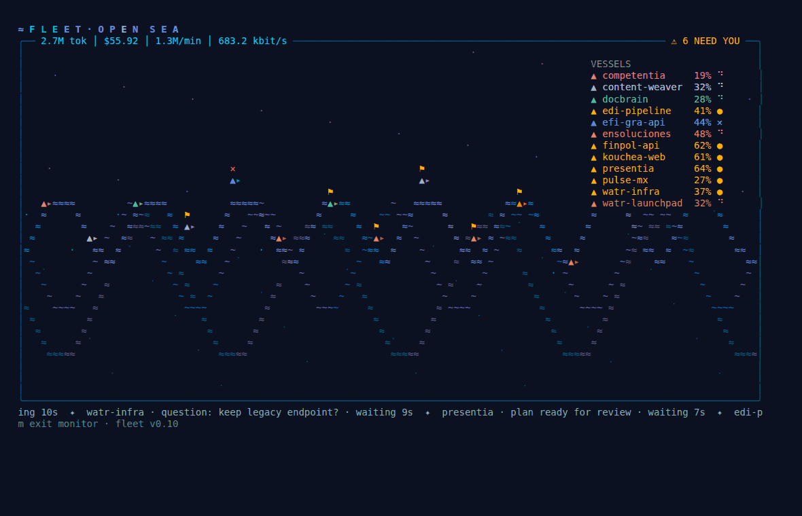
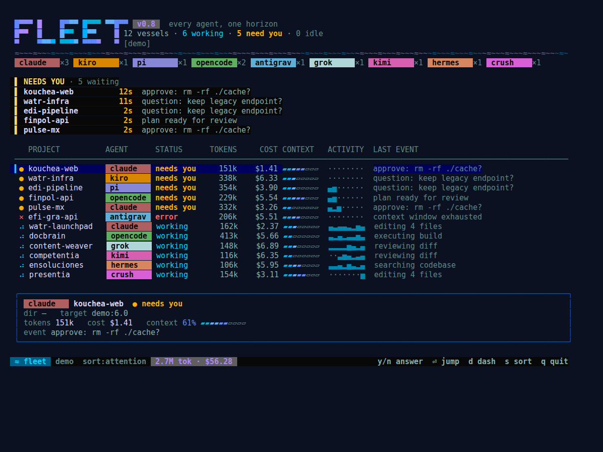
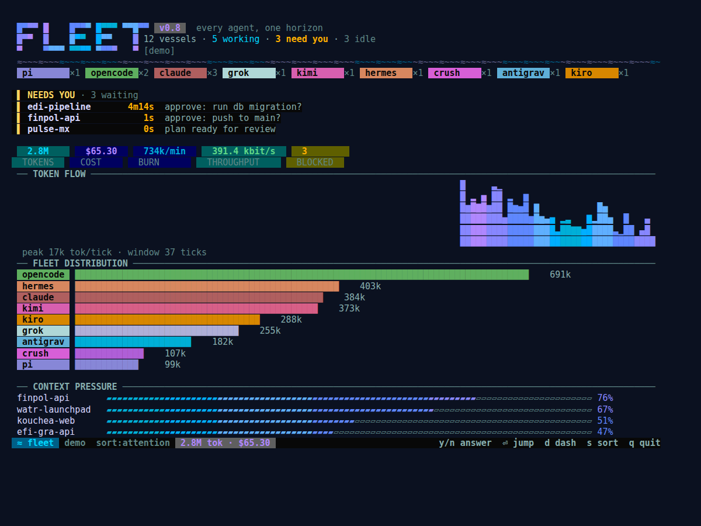

# ≈ FLEET

**A beautiful terminal dashboard for your fleet of AI coding agents.**
Every agent, one horizon: Claude Code, OpenCode, Pi, Grok, Kimi, Hermes, Antigravity, Codex, Gemini, Crush, Aider, Kiro and more — who's working, who needs you, and what it's all costing.

> Built by [WATR](https://watr.mx) on the Charm stack (Bubble Tea + Lip Gloss). MIT.

<p align="center">
  
</p>
<p align="center"><em>OPEN SEA monitor mode: every vessel is a live agent session — wave energy follows real token burn.</em></p>





## Why fleet

Running agents in parallel means jumping tab to tab. Session managers solve visibility; fleet goes further:

1. **The attention router** — every blocked session in one pulsing queue, longest-waiting first. Answer prompts with `y`/`n` **without leaving the dashboard**.
2. **Fleet telemetry** — real tokens, cost, burn rate, throughput, and context-window pressure. `htop` for agents, not another session switcher.
3. **Design excellence** — animated gradients, waves, pills and a movie-computer dashboard mode. In open source, aesthetics is distribution.

## Install

```bash
brew install edbror/tap/watr-fleet   # installs the `fleet` command; or:
go install github.com/edbror/watr-fleet@latest
```

## Run

```bash
fleet          # then press n: pick an agent, pick a directory — fleet runs it
fleet --demo   # simulated fleet, demoable anywhere
```

fleet manages sessions for you (tmux under the hood, never in your face): `n` launches a new agent, `enter` drops you in, `ctrl-b d` brings you back, `x` (twice) sinks it. Agents already running in tmux are discovered automatically too.

| Key | Action |
|-----|--------|
| `j/k` | move |
| `enter` | jump to that tmux pane |
| `n` | launch a new agent session |
| `y` / `N` | approve / deny the selected prompt remotely |
| `x` `x` | kill a fleet-managed session |
| `d` | toggle the dashboard (token flow, distribution, context pressure) |
| `m` | OPEN SEA — ambient monitor mode for a wall screen |
| `s` | cycle sort: attention / cost / project |
| `q` | quit |

## Telemetry sources

- **Claude Code**: transcripts (`~/.claude/projects`) give real tokens, cost and context pressure. Optional hooks give exact needs-you signals (see `fleet.example.toml` and README section below).
- **tmux**: discovers 24+ agent CLIs by process name *and* by process tree — node/python/bun-launched agents are identified by their script, not hidden behind the interpreter.
- **Roadmap**: Grok Build (headless JSON + ACP), OpenCode server API, ACP as the universal layer.

## Notifications

When a session stays blocked past the threshold, fleet escalates: macOS/Linux system notification, optional shell command (sounds!), optional [ntfy.sh](https://ntfy.sh) push to your phone. Configure in `~/.config/fleet/fleet.toml`.

## Config

Copy `fleet.example.toml` to `~/.config/fleet/fleet.toml`: custom agents and colors, pricing overrides, notification channels.

## Status

v0.8 — pre-release. Detection heuristics are young; issues and PRs with your agent's prompt patterns are the most valuable contribution you can make.
